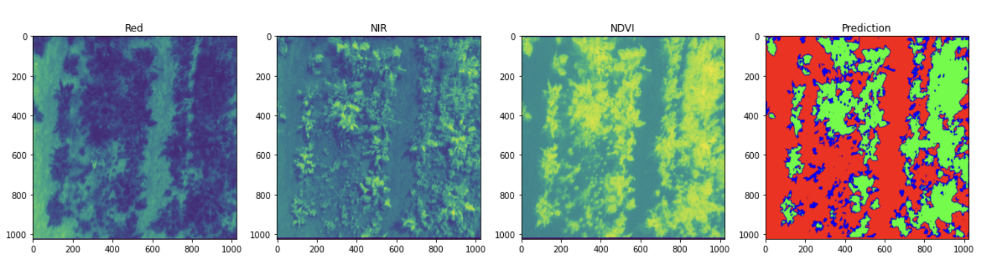
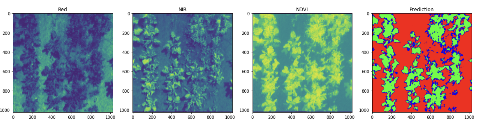
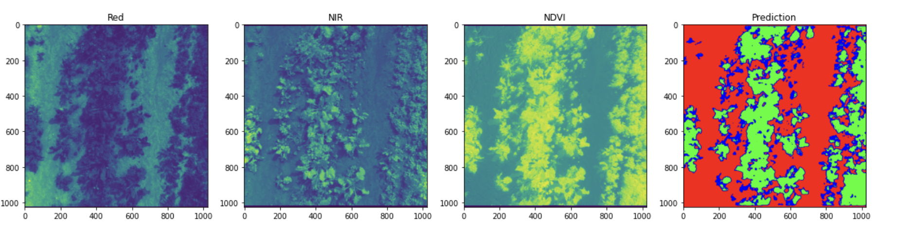
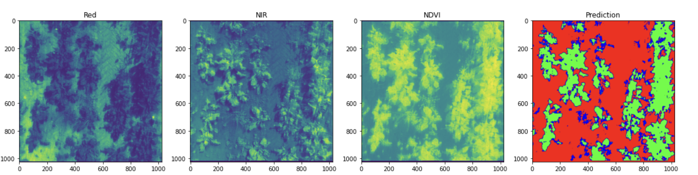

# Multi-Spectral Crop-Weed Discrimination

## Preface

    The use of Deep learning techniques in the field of agriculture is gathering rapid strides. Smart farming techniques are the need of the hour in a world where population growth is at a Geometric progression with respect to food production which grows as a function of an Arithmetic Progression. 

    The growth of unwanted weed plants around crops hinder growth of crops to drastic extents,They tend to use the soil space and nutrients essential for crops for their normal growth. This results in poor crop yield thereby causing delays in food production.

    In this paper, we introduce a deep learning based model that detects the growth of weed at their early growth stages before causing damage to the growth of crops. We achieve this by creating a new state of the architecture and technique that can discriminate crop and weed despite the lack of proper manually annotated data.

## Proposed Work

    As per the  dataset paper, the annotations for crop and weed were done separately helped by the NDVI. An NDVI is calculated from the 2 spectral channels Red and NIR , which outputs a proper distinction between green cover and land. 

    However as per the authors, it was difficult to manually annotate the images of crop and weed together due to their similarities in NDVI and RGB values. Manual annotations were provided for about 20-30 images only. 

    To perform this task,we propose a state of the art CNN based architecture. In  this model, the initial convolutions learn the spatial characteristics of crop and weed separately, to identify the shape and boundary characteristics. Then we pass the learnt embedding into a shallow U-Net, to fine tune the embedding. This approach captures not only the shape of the ground truth annotations but also the weed and crop features missed out by the original annotations due to computation and physical resource based constraints in manual annotation of agriculture data.

## File Description

| File Name                     | Description                                                         |
| ----------------------------- | ------------------------------------------------------------------- |
| arch.py                       | Source code of proposed architecture                                |
| layer_blocks.py               | Building Blocks of the proposed architecture                        |
| unet.py                       | Source code of U-Net                                                |
| augmentations.py              | Performs data augmentation and adds to disk                         |
| data_script.py                | Get the data paths stored in text files and split as train and test |
| weed_dataset.py               | Dataloader Class                                                    |
| training_loops.py             | Perform training experiments                                        |
| losses.py                     | Loss functions experimented                                         |
| metrics.py                    | Source code of metrics                                              |
| prediction_sample_tests.ipynb | Test Model Predictions, Image Transforms, Dataset Visualization     |

## Results

    
    
    
    

