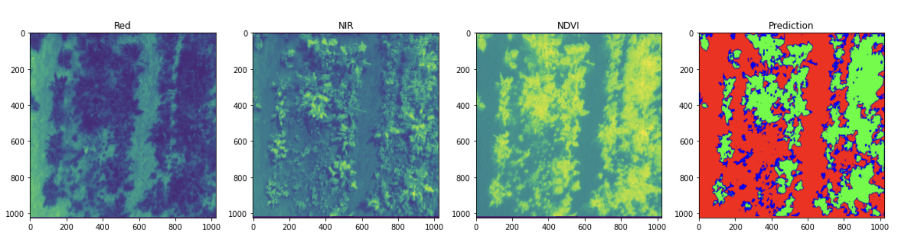
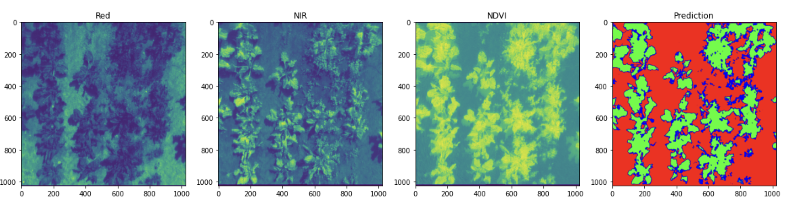
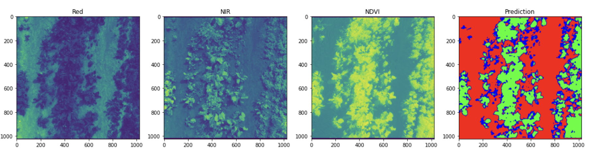
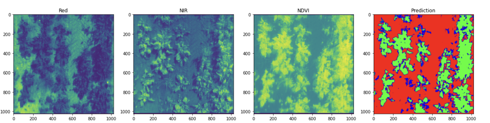

# Multi-Spectral Crop-Weed Discrimination

## Abstract 

   Crop-weed segmentation is one of the most challenging tasks in the field of computer vision. This is because, unlike other object detection or segmentation tasks, crop and weed are similar in  terms of spectral features, shape, dimensions etc. For precision agriculture to flourish in terms of smart spraying of crops, efficient systems to distinguish between crop and weed are the need of the hour, which if precise, will take a huge step towards tackling the issue of food scarcity. To tackle this issue, we propose an ensemble architecture of two models - a U-Net with a modified backbone and an Encoder-Decoder. These networks learn to distinguish between soil and crop and soil and weed respectively, whose ensemble gives state of the art results on pixel-wise annotations of combined crop and weed images. We also learn that the model captures unannotated features since each component of the architecture learnt either crop or weed features to high precision. We compared our proposed architecture with the U-Net and SegNet, which are popular segmentation networks, and consistently achieved better results.

## Dataset

    For our study, we used WeedNet, a dataset aimed at the study of distinguishing between crop and weed. The details of the study and the methodologies used in collecting  the images can be viewed <a href="#references">here</a>

## File Description

| File Name                     | Description                                                         |
| ----------------------------- | ------------------------------------------------------------------- |
|Experimental_models | Source code for U-Net, SegNet, Dilated SegNet, Deep CNN |
| Research_stuff | Contains results, confusion matrices, architecture diagrams for publication |
|augmentations.py | Contains script used for data augmentation |
|data_script.py | Helper function for data pipeline |
|losses.py| Source code for loss functions used |
|metrics.py| Source code for metrics used |
|predictions_samples_tests.ipynb| Notebook for testing models, written source code|
|test_metrics.ipynb| Compare model metrics and qualtitative analysis|
|training_loops.py| Training Models|
|Weed_dataset.py | Data Pipeline source code|

## Results

    
    
    
    

